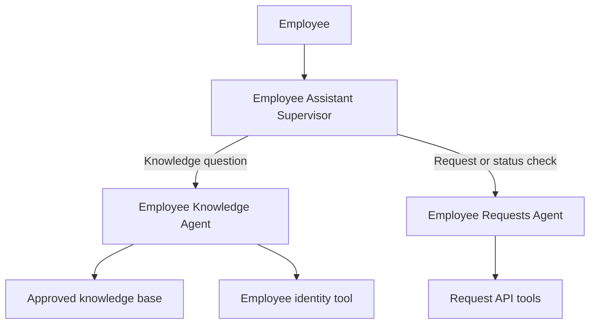

# OneDesk.ai

> One intelligent desk for workplace knowledge, support, and employee requests.

OneDesk.ai is a multi-agent employee support solution built with IBM watsonx Orchestrate. It gives employees one conversational entry point for trusted company information and workplace services. The supervisor identifies the user's intent and routes it to a specialist agent that either retrieves approved knowledge or performs a supported request action.

## Key capabilities

- Answers questions from approved HR, benefits, onboarding, office, and IT knowledge sources.
- Provides personalized guidance after verifying an employee ID.
- Submits supported employee requests through deterministic API tools.
- Checks the status of existing requests.
- Routes each message to the appropriate specialist agent.
- Uses clear fallback responses when information cannot be verified.

## Architecture



### Agents

| Agent | Responsibility |
|---|---|
| Employee Assistant Supervisor | Interprets the employee's message and routes it to the correct specialist. |
| Employee Knowledge Agent | Retrieves grounded answers from approved documents and uses verified employee context when needed. |
| Employee Requests Agent | Verifies identity, gathers required details, requests confirmation, submits requests, and checks request status. |

### Tools

| Tool | Purpose |
|---|---|
| `resolve_employee` | Verifies an employee ID and returns the applicable employee information. |
| `submit_request` | Creates a supported employee request in the mock request store. |
| `check_request_status` | Retrieves the current status of an existing request. |

## Example interactions

### Knowledge question

```text
Employee: What is the general reimbursement claim process?
OneDesk.ai: Retrieves the approved process from the relevant knowledge document.
```

### Personalized question

```text
Employee: I am Sarah, EMP101. What is my onboarding checklist?
OneDesk.ai: Verifies EMP101 and retrieves the checklist applicable to the verified department.
```

### Action request

```text
Employee: I need to request a new laptop.
OneDesk.ai: Verifies identity, collects the required information, asks for confirmation, and submits the request.
```

### Status check

```text
Employee: What is the status of request REQ-1001?
OneDesk.ai: Retrieves and returns the current request status.
```

## Repository structure

```text
OneDesk-AI/
├── agents/             # Extracted agent definitions
├── exports/            # Importable watsonx Orchestrate agent packages
├── api/                # Mock request API and OpenAPI specification
├── documents/          # Approved demonstration knowledge documents
├── tests/              # Test prompts and evaluation cases
├── .gitignore
└── README.md
```

## Prerequisites

- Python 3.11 or later
- Git
- IBM watsonx Orchestrate access
- watsonx Orchestrate Agent Development Kit (ADK)

## Local API setup

From the mock API directory, create and activate a virtual environment:

```powershell
python -m venv .venv
.venv\Scripts\Activate.ps1
python -m pip install --upgrade pip
pip install -r requirements.txt
```

Start the API using the command documented by the API implementation. For a FastAPI application whose entry point is `app.py` and application object is `app`, this is typically:

```powershell
uvicorn app:app --reload
```

Open the generated API documentation at:

```text
http://localhost:8000/docs
```

## Exporting agents from watsonx Orchestrate

Activate the target Orchestrate environment, then export each native agent:

```powershell
orchestrate agents export -n Untitled_Agent_1_1611Nb -k native -o exports/employee-requests-agent.zip
orchestrate agents export -n Untitled_Agent_1_45642X -k native -o exports/employee-knowledge-agent.zip
orchestrate agents export -n Untitled_Agent_2_6737e1 -k native -o exports/employee-assistant-supervisor.zip
```

The internal names above reflect the current project exports. Update this section if the agents are renamed in watsonx Orchestrate.

## Security and privacy

- Never commit API keys, access tokens, passwords, or `.env` files.
- Do not upload real employee records or confidential company documents.
- Use synthetic employee data and demonstration policies in public repositories.
- Keep the repository private when it contains internal or restricted material.
- Revoke and regenerate any credential that is accidentally committed.

## Project status

OneDesk.ai is currently a demonstration project. The request service uses a mock data store and should not be treated as a production HR or IT system.

## Future improvements

- Connect request actions to production HR and IT service-management systems.
- Add role-based access controls and stronger identity verification.
- Introduce persistent request storage and audit logging.
- Add automated evaluations for routing, grounded answers, and tool execution.
- Add human approval steps for sensitive employee actions.

## Disclaimer

This repository is intended for demonstration and learning purposes. Replace mock services, synthetic data, and sample policies with authorized enterprise integrations before considering production use.
